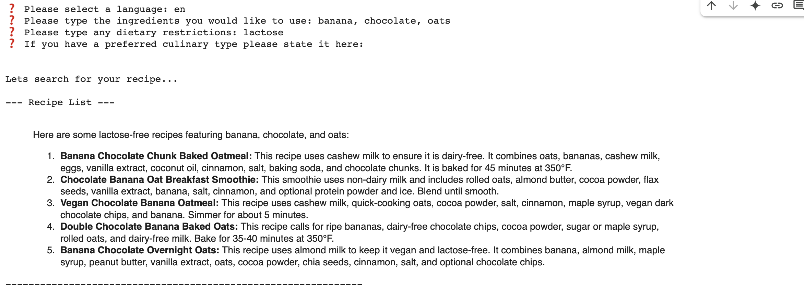
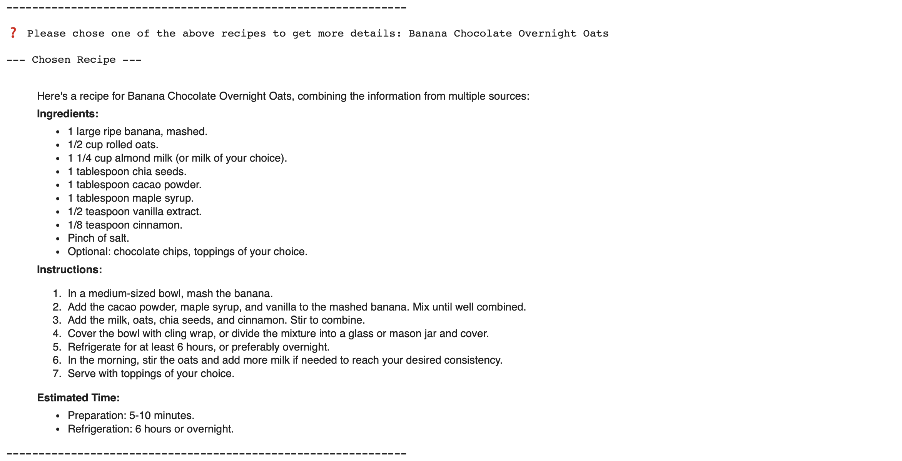
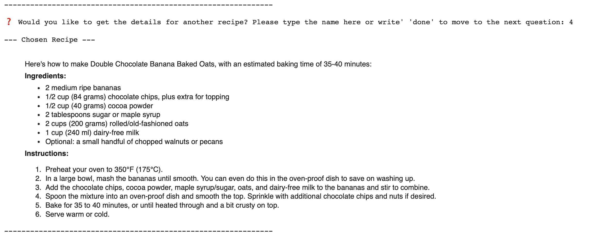
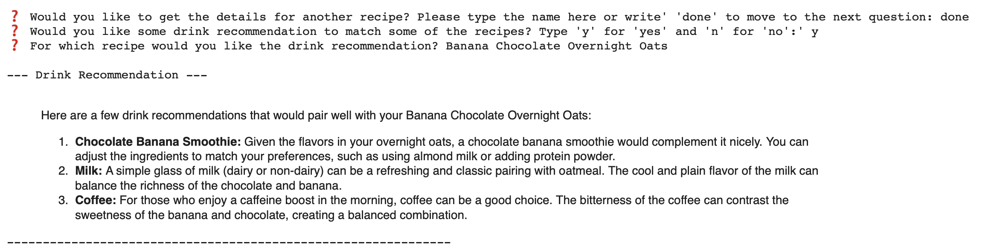
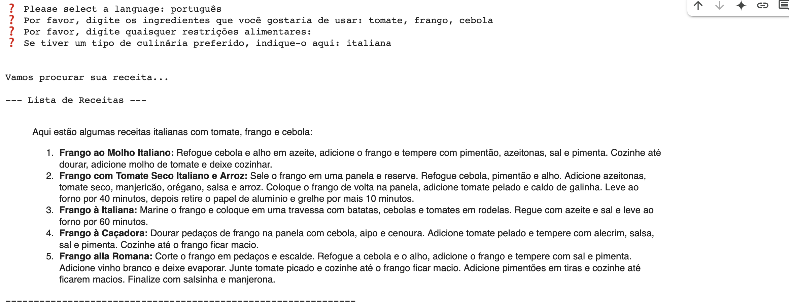
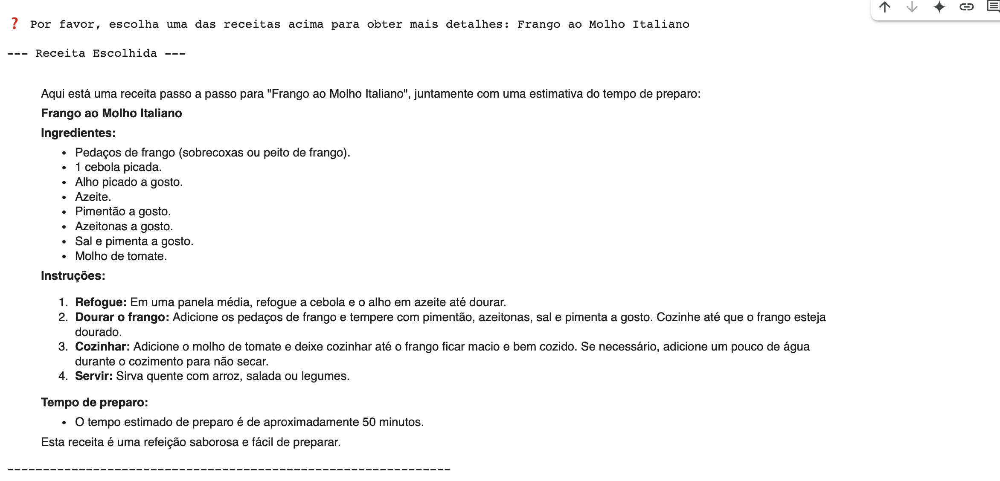
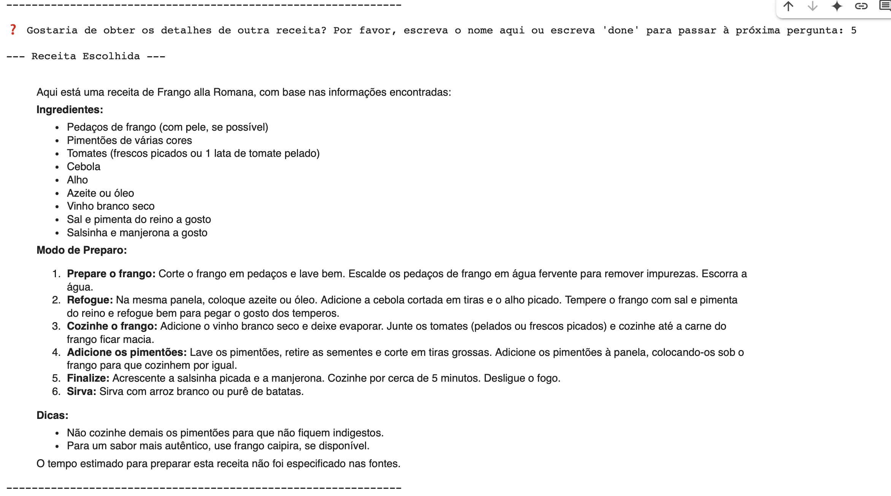
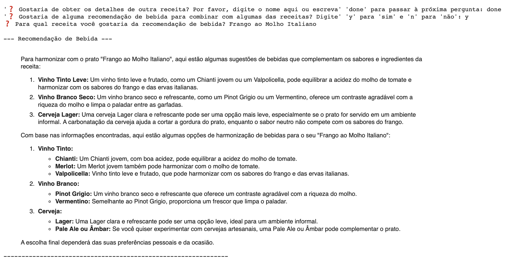

    
    

# Recipe Finder with GenAI

This is a Python project created using Google Gemini and the Google AI Developer Kit (ADK) in Google Colab to provide recipe and drink recommendations.

## 💻 Project

This project enables users to input their desired ingredients, dietary restrictions, and/or preferred cuisine, and receive a selection of recipes. It also allows users to request a drink pairing suggestion for a selected recipe.

## 💭 How it works

The project integrates with Google Gemini and creates four agents:

1.  **Translator Agent:** Translates text into the desired language.
2.  **Search Agent:** Searches for recipes based on user input.
3.  **Recipe Agent:** Provides the full recipe steps from the searched recipe list.
4.  **Drink Agent:** Recommends a perfect drink pairing for the selected recipe.

## 🧪 How to test

1.  Clone the repository.
2.  Open the notebook [RecipeFinder](https://colab.research.google.com/drive/1JfKdR1iBIZXN25QFj-9q8IXtdAba1xvD?usp=sharing) on Google Colab.
3.  Follow the steps in the notebook.

## ✅ Result example

    
    
    
    

## 🔜 Next steps

The next steps for this project include building a user interface to integrate the functionality via an API.

---

# 🇧🇷 Recipe Finder com GenAI

Este é um projeto em Python criado usando o Google Gemini e o Google AI Developer Kit (ADK) no Google Colab para fornecer recomendações de receitas e bebidas.

## 💻 Projeto

Este projeto permite que os usuários insiram os ingredientes desejados, restrições alimentares e/ou culinária preferida, e recebam uma seleção de receitas. Também permite que os usuários solicitem uma sugestão de bebida para a receita selecionada.

## 💭 Como funciona

O projeto integra-se ao Google Gemini e cria quatro agentes:

1.  **Agente Tradutor:** Traduz o texto para o idioma desejado.
2.  **Agente de Busca:** Busca receitas com base na entrada do usuário.
3.  **Agente de Receita:** Fornece os passos completos da receita a partir da lista de receitas pesquisadas.
4.  **Agente de Bebida:** Recomenda uma bebida que harmonize perfeitamente com a receita selecionada.

## 🧪 Como testar

1.  Clone o repositório.
2.  Abra o notebook [RecipeFinder](https://colab.research.google.com/drive/1JfKdR1iBIZXN25QFj-9q8IXtdAba1xvD?usp=sharing) no Google Colab.
3.  Siga os passos no notebook.

## ✅ Exemplo de resultado

    
    
    
    

## 🔜 Próximos passos

Os próximos passos para este projeto incluem a construção de uma interface de usuário para integrar a funcionalidade via uma API.
